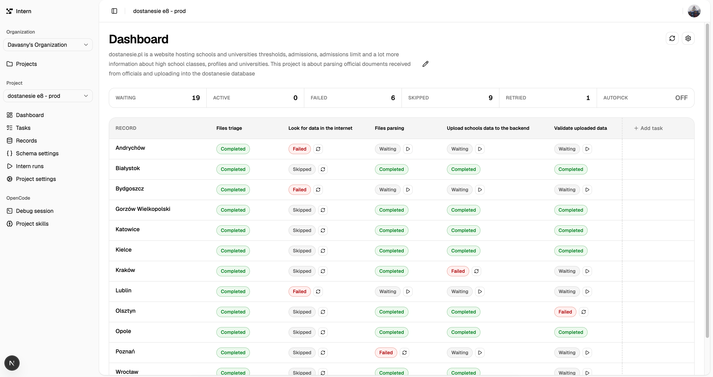

# project-intern

> My bet on LLMs - perfect for hihgly precised tasks with defined input and output, just like interns at big corps.



## Prerequisites

- installed [opencode 1.x] (https://opencode.ai/) with at least one provider configured
- [pnpm](https://pnpm.io/)

## Installation

```bash
pnpm install

# psql db
docker compose up -d

# nextjs frontend process
pnpm dev

# workers
pnpm dev:worker
```

Go to [http://localhost:3000](http://localhost:3000), create a new project, add new tasks and records.

## Concept

### Tasks

Task has to be understood like in any other task management system, despite the fact that tasks are not assignable to
humans. Tasks has its own name and description, but status is related to each record. Tasks are always sorted by
requried execution sequence. E.g. data fetchin task should be placed before files parsing.
Each task is beeing executed in the context of single record ensuring limited context and cross-records isolation to
avoid possible hallucinations.

Tasks description should contain instruction to the llm how to resolve the task, what is the input and what output is
expected. It should also describe definition-of-done to cearly state what is the end-goal of the task.

### Records

Records are like companies/customers in CRM systems. Record is some entity having a name, id, its own context and files.
Each _record_ have relation to all tasks. Each task has to be executed in the context of record.

## Example usages

### Files parsing & uploads

project-intern can be used as the agent orchestrator to manage and track files processing which are thigly coupled with
real world objects. In our case the records are universities in poland, and tasks are actions that normally would be
taken by a human:

1. Triage files - determine if the files found in data directory contains university thresholds, admission limit etc.
2. Parse files - conver the files into machine-friendly format like csv or md
3. Upload data - use 3rd party backend api to upload extracted data
4. Verify upload - use markitdown to extract random rows from original files and compare with uploaded data. Fail the
   task if there is any missmatch

### Job offer analysis

Project "job portals":

1. Fetch job offers - go to the portal url provided in record context and fetch all job offers. For each new job offer
   create entry in project "job offers"

Project "job offers":

1. Job offer triage - read job offer and compare with my skills: <skills list>
2. Apply - if my skills match the job listing use agent-browser skill and apply

# License

MIT License
